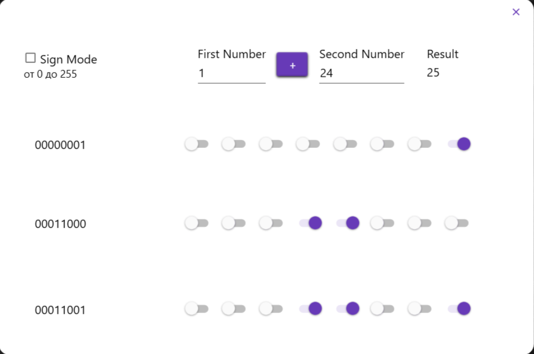
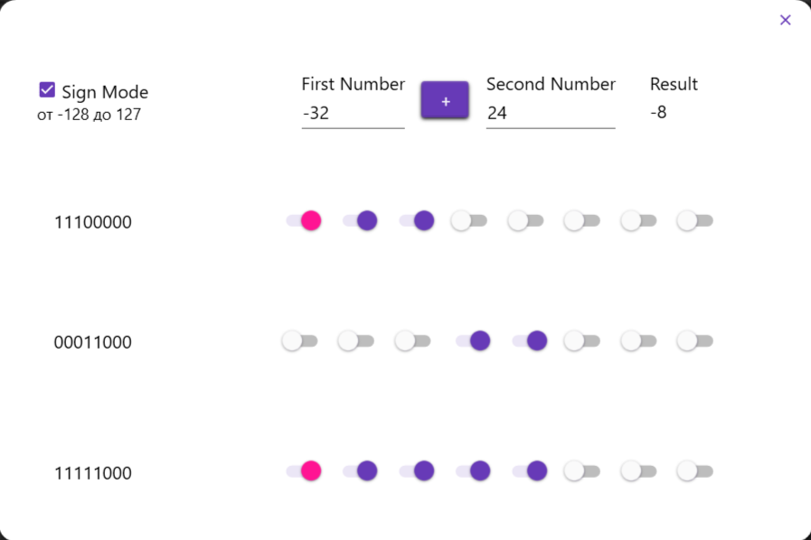

### 📋 Описание проекта
> WPF-приложение, реализующее функциональность 8-битного арифметико-логического устройства, способного выполнять операции как с беззнаковыми, так и со знаковыми числами.

### 🔢 Режим без знака (Unsigned Mode)
* Диапазон входных значений: 0 - 255
* Диапазон результата: 0 - 255 (с учётом переполнения)

### 🔣 Режим со знаком (Signed Mode)
* Диапазон входных значений: -128 - 127
* Диапазон результата: -128 - 127 (с учётом переполнения)

